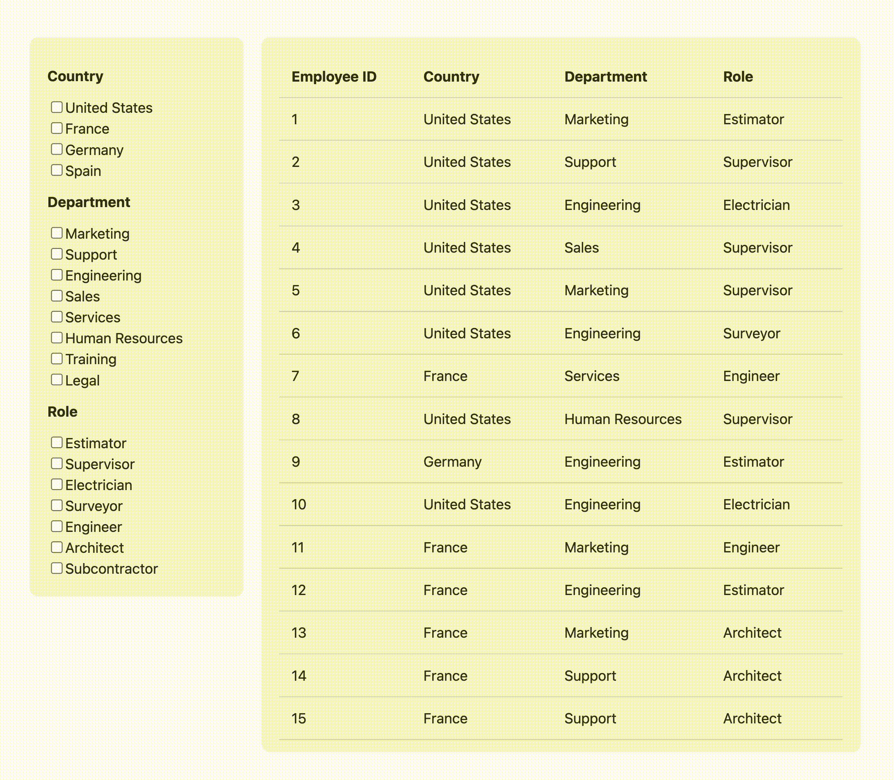

# Home assignment

## Requirements
- Your task is to create a UI that has following elements:
    - List of filters, where users can select one or many options
    - Table with data relevant to applied filters
- The UI should have following functionality:
    - All data is fetched from the server on initial render
    - Relevant data is fetched from the server when filters are applied (fetch data automatically after user selects options, or add an "Apply" button to trigger the fetch).
- You are allowed to change any file/folder in this project, except ./server/data.json.
- ***You are not allowed to use existed framework/library/package to build a table.***
- Choose CSS styles as you like, it doesn't have to be 1:1 as example below.
- Make sure your solution is fully functional in dev mode, you don't need to build it.
- Submit your solution in a .zip file, or upload it somewhere and provide a link.

## Server
Server code is located in `./server` directory. It contains a basic Express server with a single endpoint. You don't need to change server code to complete the task, but feel free to make changes if you want. To start the server run:

```
npm run start
```

Endpoint usage examples:

`/api` - returns all data

`/api?department=Sales,Services&role=Supervisor` - returns subset of data

## Client
Client code is located in `./client` directory. It has a basic React template initialized with [Vite](https://vitejs.dev/), and constants you can use in your code. To start client dev server run:

```
npm run dev
```

Please note that dev server is configured with [proxy](https://vitejs.dev/config/server-options.html#server-proxy) to avoid CORS problems. Example:

`http://localhost:5173/api` will be forwarded to `http://localhost:3000/api`

## Example
